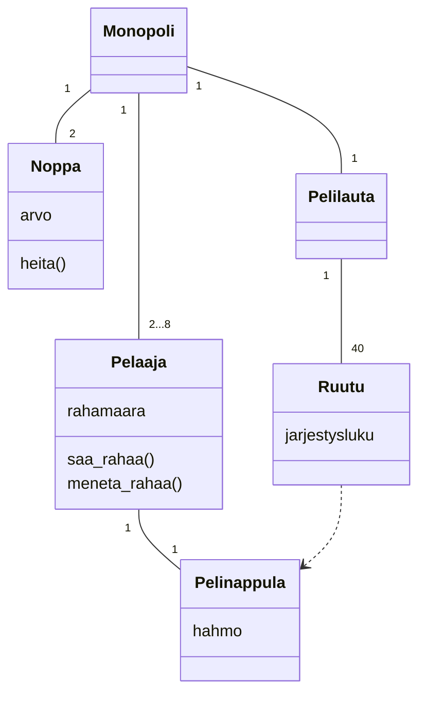

## Tehtävä 1: Monopoli

```mermaid
 classDiagram
      Monopoli "1" -- "2" Noppa
      Monopoli "1" -- "1" Pelilauta
      Pelilauta "1" -- "40" Ruutu
      Monopoli "1" -- "2...8" Pelaaja
      Pelaaja "1" -- "1" Pelinappula
      Ruutu ..> Pelinappula
      class Monopoli
      class Noppa{
          arvo
          heita()
      }
      class Pelilauta
      class Pelaaja {
          rahamaara
          saa_rahaa()
          meneta_rahaa()
      }
      class Pelinappula {
          hahmo
      }
      class Ruutu {
          jarjestysluku
      }
```
